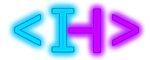

# i1ai.github.io
# Ilai Harary Portfolio Website

A modern, responsive portfolio website showcasing my skills, education, work history, and projects. This website features a sleek, dark-themed design with neon accents and smooth animations.



## Table of Contents
- [Overview](#overview)
- [Features](#features)
- [Project Structure](#project-structure)
- [Technologies Used](#technologies-used)
- [Implementation Details](#implementation-details)
  - [Design Strategy](#design-strategy)
  - [Animation Strategy](#animation-strategy)
  - [Responsive Design](#responsive-design)
- [Installation & Setup](#installation--setup)
- [Future Enhancements](#future-enhancements)

## Overview

This portfolio website serves as my professional online presence, highlighting my computer science background, skills, and projects. The design features a dark theme with vibrant neon purple and blue accents for a modern tech aesthetic.

## Features

- Responsive design that works on all device sizes
- Smooth scrolling navigation
- Animated section transitions using AOS (Animate On Scroll)
- Dark theme with neon color accents
- Interactive navigation highlighting the current section
- SVG social media icons with hover effects
- Call-to-action buttons with gradient effects
- Project showcase section (ready for future projects)
- Contact section with social media links

## Project Structure

```
portfolio-website/
│
├── index.html         # Main HTML document
├── css/
│   └── styles.css     # CSS stylesheet
├── js/
│   └── scripts.js     # JavaScript functionality
├── images/
│   ├── logo.png       # Site logo
│   └── hero-image.jpg # Hero section background
└── README.md          # This documentation
```

## Technologies Used

- **HTML5** - Website structure and content
- **CSS3** - Styling, animations, and responsive design
  - Custom properties
  - Flexbox
  - CSS Grid
  - Media queries
  - Linear gradients
  - CSS animations
- **JavaScript** - Interactive elements and smooth scrolling
- **External Libraries**:
  - **Google Fonts** - Roboto font family
  - **AOS (Animate On Scroll)** - Section animations
- **SVG Icons** - Custom social media icons

## Implementation Details

### Design Strategy

The website follows a modern, dark-themed aesthetic with neon accents to create a tech-focused atmosphere:

1. **Color Scheme**:
   - Background: Dark gradient (#0a0a0a to #111111)
   - Primary accent: Neon purple (#BF00FF)
   - Secondary accent: Neon blue (#00C8FF)
   - Text: Light gray (#e0e0e0)

2. **Typography**:
   - Roboto font family for clean, modern text
   - Larger font sizes for headings with text shadows
   - Comfortable line height (1.6) for readability

3. **Layout**:
   - Fixed navigation bar with logo and links
   - Full-height hero section with overlay
   - Centered content with max-width constraints
   - Card-based layouts for education, work, and projects
   - Skills displayed as interactive tags

### Animation Strategy

Animations are used strategically to enhance user experience without overwhelming:

1. **AOS Library Implementation**:
   - Fade-up animations for section titles and content
   - Staggered delays for list items (skills section)
   - One-time animations to avoid distraction on scroll

2. **CSS Transitions**:
   - Smooth hover effects on navigation links
   - Scale and shadow effects on interactive elements
   - Gradient transitions on buttons

3. **Custom Animations**:
   - Neon flicker effect using keyframes animation
   - Smooth scrolling behavior

### Responsive Design

The website is fully responsive with special considerations for different device sizes:

1. **Mobile-First Approach**:
   - Flexible layouts that adapt to screen size
   - Column layout for navigation on small screens
   - Adjusted padding and margins for mobile devices

2. **Media Queries**:
   - Breakpoint at 768px for layout changes
   - Adapted navigation for smaller screens
   - Responsive font sizes and spacing

## Installation & Setup

1. **Clone or download the repository**:
   ```
   git clone https://github.com/i1ai/portfolio.git
   ```

2. **Navigate to the project directory**:
   ```
   cd portfolio
   ```

3. **Open the project**:
   - To view locally, open `index.html` in your browser
   - To modify, use your preferred code editor

4. **Making changes**:
   - Edit HTML content in `index.html`
   - Modify styles in `css/styles.css`
   - Update functionality in `js/scripts.js`
   - Add/replace images in the `images` directory

## Future Enhancements

- Add actual projects to the Projects section
- Implement a working contact form with backend integration
- Add a dark/light theme toggle
- Create a blog section for tech articles
- Add filtering capability for projects by technology
- Implement a resume download button
- Add more detailed project pages with case studies